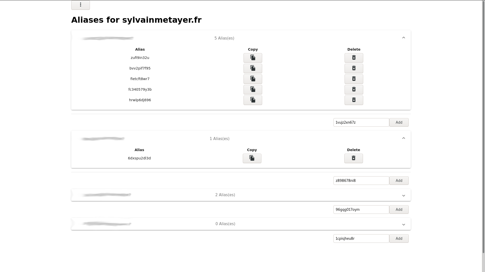
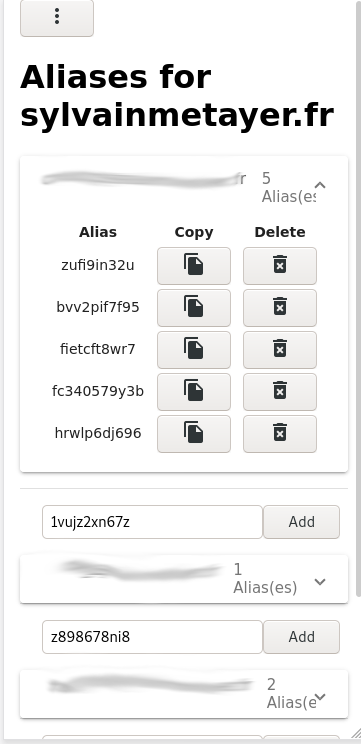

# Alias Gandi Angular

If you have your domains on Gandi, manage your email aliases easily with this small web app. It will fetch all your domains, and list associated mailboxes so you can add aliases on it.

This project was initially made to be available for all gandi users, using the [Gandi ID provider](https://docs.gandi.net/en/rest_api/oauth2/using_oauth2_server.html). Because the API is currently in beta, this is not possible, only the login flow is available, the associated `access_token` we get from here is not usable to get domains and emails data. You have to generate your own API key from [here](https://docs.gandi.net/fr/noms_domaine/utilisateurs_avances/api.html) and deploy your own version of this application if you want to use it. See ([issue #4][i4]) for details.

## Deploy your own instance

You can easily host your own instance for free, thanks to [Netlify](https://netlify.com) and their serverless functions. The free tier offered should be more than enough for personal use. 

Click the button below to deploy an instance, with this repository as template.

You'll have to configure a few environnements variable before you can access your own instance.

|Parameter|Comment|
|--|--|
|GANDI_API_KEY|Your API Key to interact with your Gandi account. [See here on how to get it](https://docs.gandi.net/fr/noms_domaine/utilisateurs_avances/api.html)|
|JWT_SECRET|A >=32 char string, randomly generated to act as your JWT secret.|
|LOGIN_PASSWORD|The password you'll use to login to the app.|
|GANDI_API_HOST|The base URL of the Gandi API, leave it with default value.|
|GANDI_API_VERSION|The version of the Gandi API, leave it with default value.|

Generate a JWT_SECRET with the following command : `cat /dev/urandom | tr -dc 'a-zA-Z0-9' | fold -w 32 | head -n 1`.

## Start

- `cp .env.dist .env && vim .env` : Setup environment variables. See section below
- `npm ci` : Install dependencies
- `npm ci --prefix netlify` : Install lambda dependencies
- `npm run lambda:tsc:watch` : In a separate terminal, will allow to watch and compile `ts` files to the lambdas folder.
- `npm run dev` :  This will start the netlify dev environment.
- Open `localhost:3000`

You *do not* have to start the angular server as it will be automatically be started by `netlify-cli`. If you only want to edit angular part without netlify, run `npm start`

Their is a proxy where lambdas are executed at `http://localhost:4200/api/*`. See `proxy.config.json` for details.

## Screenshots

[i4]: https://github.com/sylvainmetayer/alias-gandi-angular/issues/4
